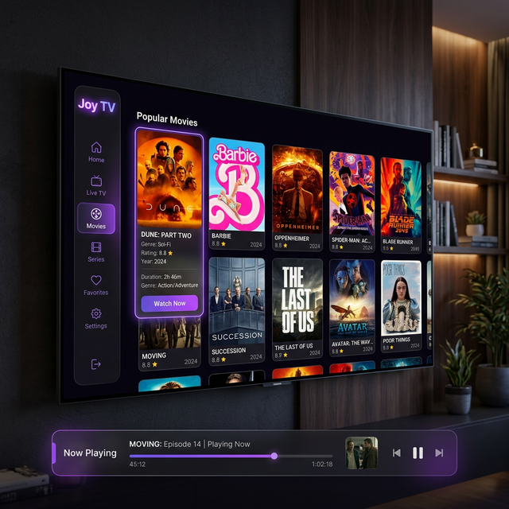

# 📺 Joy TV

[](https://flutter.dev)
[](https://dart.dev)
[](https://opensource.org/licenses/MIT)

**Joy TV** is a premium, open-source IPTV application built with Flutter, designed to provide a cinematic viewing experience on both Android TV and mobile devices. With a focus on high performance, sleek UI, and seamless content integration, Joy TV brings your favorite live channels, movies, and series together in one beautiful interface.



## ✨ Features

- **🚀 High-Performance Streaming:** Powered by `better_player_plus` for smooth playback and wide codec support.
- **📱 Cross-Platform Design:** Optimized for both touch-based mobile devices and remote-controlled Android TV.
- **🎨 Premium AMOLED Theme:** Deep blacks, vibrant violet accents, and glassmorphism elements for a modern, high-end feel.
- **📺 Live TV & EPG:** Full M3U/M3U8 playlist support with efficient parsing and caching.
- **🎬 Movies & Series:** Seamless integration with TMDB for rich metadata, posters, and content discovery.
- **🔍 Smart Search:** Quickly find your favorite channels or movies with an intuitive search interface.
- **⚡ Built for Speed:** Virtualized lists and grids ensure smooth performance even with thousands of channels.

## 🛠️ Tech Stack

- **Framework:** [Flutter](https://flutter.dev)
- **State Management:** [flutter_bloc](https://pub.dev/packages/flutter_bloc)
- **Video Engine:** [better_player_plus](https://pub.dev/packages/better_player_plus)
- **Parsing:** [xml](https://pub.dev/packages/xml), [intl](https://pub.dev/packages/intl)
- **Networking:** [http](https://pub.dev/packages/http), [cached_network_image](https://pub.dev/packages/cached_network_image)
- **Theming:** Google Fonts (Inter)

## 🚀 Getting Started

### Prerequisites

- Flutter SDK (latest stable version)
- Android Studio / VS Code
- An Android TV or Emulator for testing TV features

### Installation

1.  **Clone the repository:**
    ```bash
    git clone https://github.com/yourusername/joy_tv.git
    cd joy_tv
    ```

2.  **Install dependencies:**
    ```bash
    flutter pub get
    ```

3.  **Run the app:**
    ```bash
    flutter run
    ```

## 📂 Project Structure

- `lib/screens`: Main UI screens (Home, Player).
- `lib/services`: Core logic for playlist parsing, caching, and stream handling.
- `lib/models`: Data models for channels and content.
- `lib/theme`: Centralized design tokens and premium styling.
- `assets/`: IPTV playlists and static resources.

## 📄 License

This project is licensed under the MIT License - see the [LICENSE](LICENSE) file for details.

---

*Made with ❤️ for the open-source community.*
